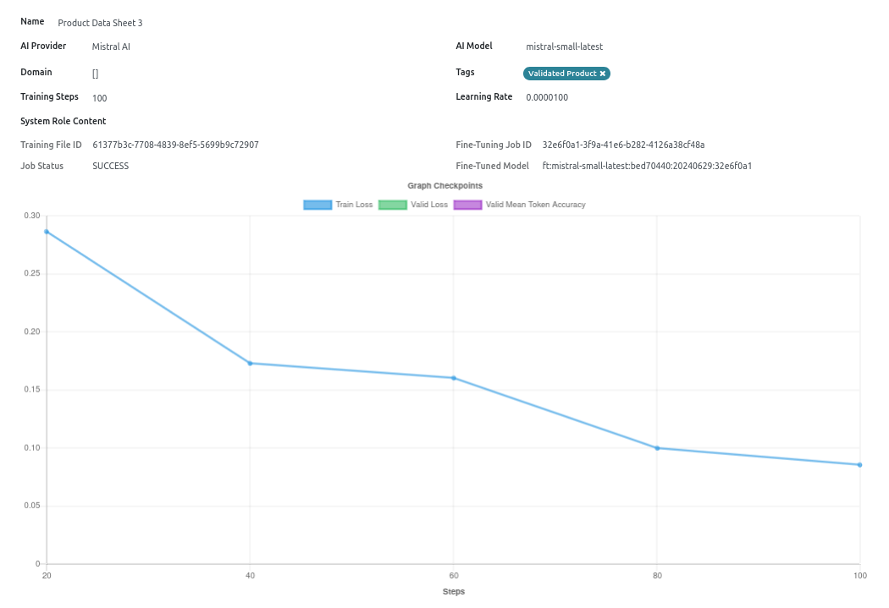
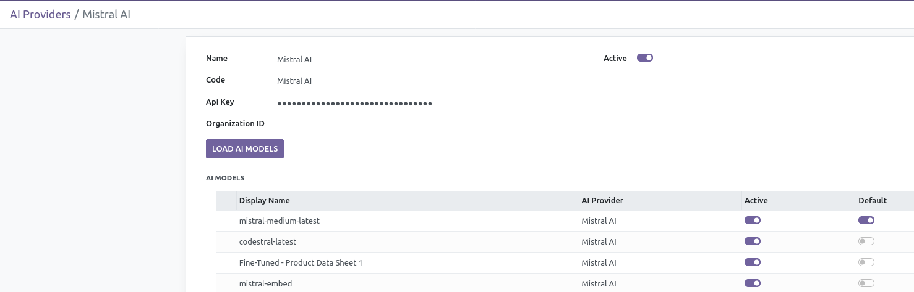

# Mistral AI Fine-Tuning Hackathon

Mistral AI Fine-Tuning in Odoo

This project is based on Odoo [AI Connector](https://github.com/myrrkel/odoo-ai) and [File2Record](https://github.com/myrrkel/odoo-file2record)

Most of the work done for the hackathon has been adding Fine-Tuning features in AI Connector.

Presentation video : [Hackathon Mistral AI : Fine-Tuning in Odoo](https://www.youtube.com/watch?v=yidH_Sfk8Jk)

# Installation

To start the project, run the following command:

    git submodule update --init --recursive
    git pull --recurse-submodules

    docker compose up

when Odoo is running on http://10.1.0.1:8069 run odoo-configurator:

    pip install odoo-configurator

    odoo-configurator config/configurator.yml

Connect in Odoo (login: admin, pwd: admin)

Set your API key in "AI Tools", "Providers":

# Credits

* Created by [Michel Perrocheau](https://github.com/myrrkel). 
* Contact on [LinkedIn](https://www.linkedin.com/in/michel-perrocheau-ba17a4122). 